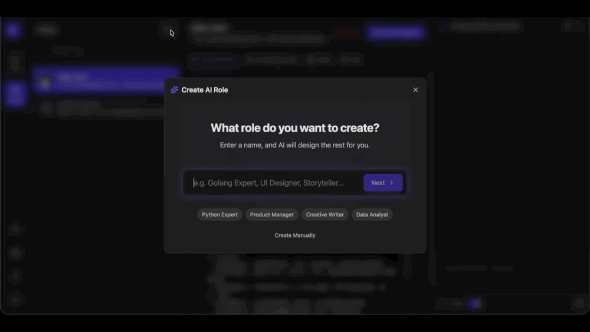
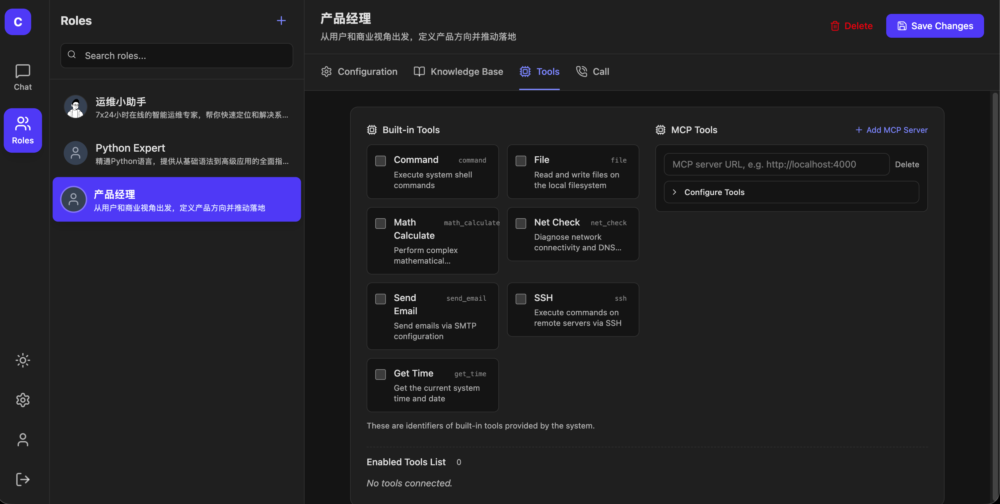
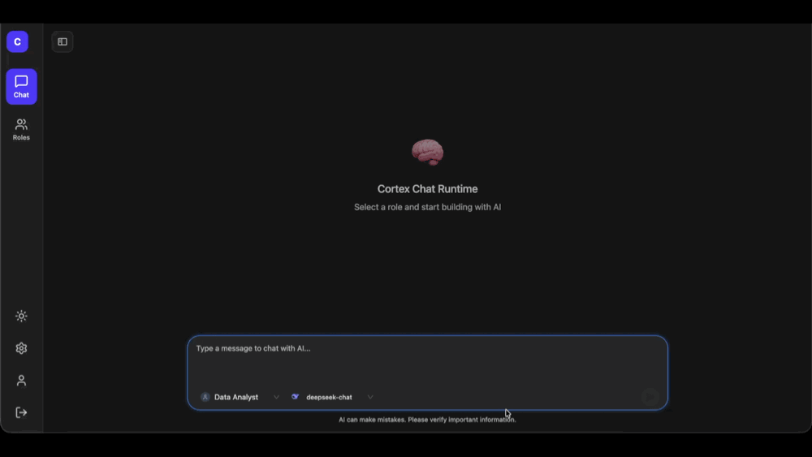
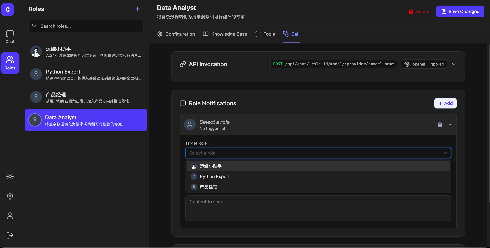

# Cortex Lab

<p align="center">AI Agent Experimentation & Prompt Engineering Platform</p>

<p align="center">
  
  
</p>

<p align="center">
  <a href="#overview">Overview</a>
  · <a href="#features">Features</a>
  · <a href="#architecture">Architecture</a>
  · <a href="#getting-started">Getting Started</a>
</p>

<p align="center">
  English | <a href="README-CN.md">简体中文</a>
</p>

## Overview

Cortex Lab is a platform designed for **AI Agent experimentation**, specifically tailored for **debugging prompts and tools**. It provides an environment where you can iteratively refine your agents, ensuring they perform exactly as intended.

> This project's agent capabilities are built upon the [Cortex](https://github.com/xichan96/cortex) framework.

## Features

1.  **Intelligent Prompt Engineering**
    AI automatically assists you in writing or optimizing role prompts, making the prompt creation process more efficient and effective.

    

2.  **Tool Integration**
    Easily configure the tools required by your roles. Cortex Lab supports **MCP (Model Context Protocol)** and a variety of built-in tools, giving your agents the capabilities they need.

    

3.  **Experience Management**
    Solidify useful knowledge into "Experiences". This feature supports **progressive disclosure**, ensuring agents have the right context without being overwhelmed.

    

4.  **Role-to-Role Collaboration**
    Enable roles to call other specialized roles. Like a well-organized team, each role focuses on its expertise, collaborating to solve complex problems.

    

## Architecture

Cortex Lab follows a modular architecture:

- **Frontend**: React + Vite + Tiptap + Shadcn/ui
- **Backend**: Go + Gin + MySQL + [Cortex Framework](https://github.com/xichan96/cortex)
- **MCP Integration**: Supports local and remote MCP servers.

## Getting Started

### Docker Quick Start

The easiest way to start Cortex Lab is using Docker Compose.

1.  **Clone the repository**
    ```bash
    git clone https://github.com/xichan96/cortex-lab.git
    cd cortex-lab
    ```

2.  **Start with Docker Compose**
    ```bash
    docker-compose up -d
    ```

3.  **Access the application**
    Open your browser and visit [http://localhost](http://localhost).

### Prerequisites

- Go 1.21+
- Node.js 18+
- MySQL 8.0+

### Installation

1.  **Clone the repository**
    ```bash
    git clone https://github.com/xichan96/cortex-lab.git
    cd cortex-lab
    ```

2.  **Backend Setup**
    ```bash
    cd backend
    # Update config.yaml with your database and LLM settings
    go mod download
    go run cmd/app/main.go
    ```

3.  **Frontend Setup**
    ```bash
    cd frontend
    npm install
    npm run dev
    ```